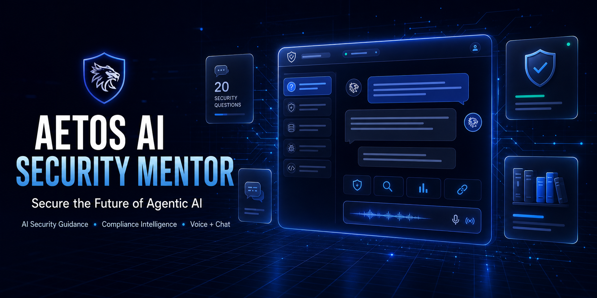
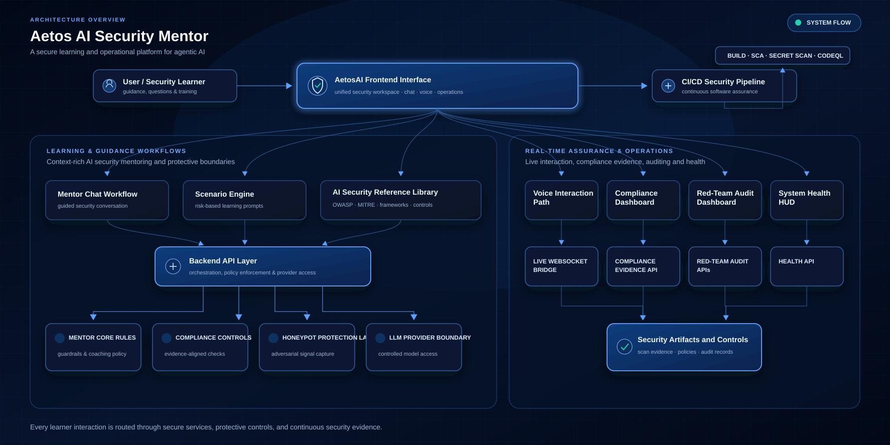

<h1 align="center">Cyber Offense Analyst Program</h1>

  Cyber Offense Analyst Program case study for Azure lab security, evidence capture, and remediation practice.

  
  
  
  

## Inception State vs Completion State

| Inception State | Completion State |
| --- | --- |
| No isolated lab story, no formal evidence trail, and no linear analyst workflow. | An isolated Azure lab with lifecycle controls, CI/CD security checks, evidence-driven findings, and documented remediation/retest proof. |
| No single README that tells the full case-study story. | A single main README that reads like a Cyber Offense Analyst case study from discovery through validation. |
| No structured mapping between findings, evidence, and analyst ownership. | Findings, evidence, metrics, and remediation artifacts are all linked and reviewable. |

## Table of Contents

- [Visual Overview](#visual-overview)
- [Architecture at a Glance](#architecture-at-a-glance)
- [Application Assessment](#application-assessment)
- [Build and Deployment Flow](#build-and-deployment-flow)
- [CI/CD and Security Testing Coverage](#cicd-and-security-testing-coverage)
- [Analyst Lifecycle](#analyst-lifecycle)
- [Testing Scope and Rules of Engagement](#testing-scope-and-rules-of-engagement)
- [Threat Model and Trust Boundaries](#threat-model-and-trust-boundaries)
- [Finding Intake, Risk Mapping, and Ownership](#finding-intake-risk-mapping-and-ownership)
- [Remediation and Validation Proof](#remediation-and-validation-proof)
- [Evidence Index](#evidence-index)
- [Metrics and Reporting](#metrics-and-reporting)
- [Lessons Learned / Program Outcome](#lessons-learned--program-outcome)
- [Deeper Investigation Archive](#deeper-investigation-archive)
- [Program Demos and Supporting Notes](#program-demos-and-supporting-notes)

## Visual Overview

  

  

## Architecture at a Glance

The Cyber Offense Analyst Program is presented here as a documentation-first case study with the application details intentionally abstracted away from the main story.

### High-level flow

1. A browser or Kali workstation talks to the lab target.
2. The target is described in the case-study docs as a React + Vite frontend with a Node/Express backend.
3. Terraform provisions Azure lab infrastructure.
4. GitHub Actions builds, scans, and deploys the lab artifacts.
5. Burp Suite and ZAP provide manual and baseline validation evidence.
6. Findings are tracked in a workbook and remediated with retest proof.

### Major components

| Component | Purpose |
| --- | --- |
| Browser / analyst workstation | Manual validation and evidence capture |
| Program target | Cyber Offense Analyst Program case-study lab |
| Infrastructure layer | Repeatable cloud provisioning for the lab |
| Hosting layer | Low-cost Azure hosting target |
| Automation layer | Build, scan, and deploy workflow support |
| Validation layer | Proxying, manual verification, and baseline DAST |
| Findings layer | Analyst tracking for ownership and closure |

## Application Assessment

This section summarizes the enterprise-level shape of the program target without exposing implementation details.

### Confirmed facts

| Category | Enterprise baseline |
| --- | --- |
| Application type | Single-service web application |
| Runtime | Modern JavaScript/TypeScript stack |
| Deployment model | Container-ready, with repeatable infrastructure support |
| Data layer | Lightweight baseline without an enterprise database requirement |
| External dependency | One third-party AI service integration |
| Hosting posture | Low-cost Azure hosting with scale-to-zero characteristics |

### Assessment summary

- The app is already suited to a container-first lab deployment.
- The service is single-process and low enough complexity for Azure Container Apps.
- The app does not need a heavyweight database for the current baseline.
- Cost control matters, so the README and supporting docs treat stop/start behavior as a first-class concern.

### Supporting document

- [Application assessment](docs/application-assessment.md)

## Build and Deployment Flow

The lab uses a repeatable build and deploy path rather than manual console work.

### Flow

1. Validate the repo and app locally.
2. Build the application bundle and container image.
3. Provision the isolated Azure lab with Terraform.
4. Deploy the app to the lab host.
5. Verify the app responds on the generated Azure endpoint.
6. Capture validation evidence.

### Operational commands

| Command | Purpose |
| --- | --- |
| `./scripts/deploy.sh` | Validate prerequisites, show plan, apply Terraform, deploy the app, and run a non-destructive health check. |
| `./scripts/start.sh` | Restore the lab runtime after a stop. |
| `./scripts/stop.sh` | Reduce runtime cost without destroying the lab. |
| `./scripts/status.sh` | Show subscription, resource group, hosting state, URL, and readiness. |
| `./scripts/destroy.sh` | Show the destroy plan, require confirmation, and remove the lab. |

The matching PowerShell wrappers are available under `scripts/` as well.

## CI/CD and Security Testing Coverage

GitHub Actions is the backbone of the repository’s security pipeline and deployment story.

### Existing workflows

| Workflow | Purpose |
| --- | --- |
| `.github/workflows/deploy-security-lab.yml` | Builds the app, runs validation, builds and pushes the lab image, and deploys the Azure lab environment. |
| `.github/workflows/security-ci.yml` | Runs build validation, npm audit capture, CodeQL, and secret scanning. |
| `.github/workflows/dependency-review.yml` | Reviews dependency changes in pull requests. |
| `.github/workflows/terraform-security.yml` | Scans Terraform for infrastructure misconfigurations. |
| `.github/workflows/container-security.yml` | Checks container build and image security. |
| `.github/workflows/zap-baseline.yml` | Runs a manual passive ZAP scan against the lab endpoint after the environment is stable. |

### What the pipeline proves

- The application can be built reproducibly.
- Secrets and dependency issues are checked in CI.
- Infrastructure changes are scanned before deployment.
- Container artifacts are reviewed as part of the delivery path.
- Deployment is lab-only and should not be confused with production release logic.

### Security testing coverage

| Area | Tooling | Notes |
| --- | --- | --- |
| SAST | CodeQL | Source and dependency-aware code analysis |
| Secrets | Gitleaks | Secret scanning in CI and local hooks |
| Dependency review | GitHub dependency review | Guards pull requests |
| IaC security | Checkov / Terraform review | Flags Terraform misconfigurations |
| Container security | Container workflow checks | Supports image hygiene |
| DAST / manual validation | Burp Suite and ZAP | Used for lab-side review and retest evidence |

### CI/CD narrative note

The baseline workflow set supports the current lab scope. If the lab expands later, additional workflows can be added without changing the case-study narrative.

## Analyst Lifecycle

The analyst workflow follows a repeatable lifecycle:

1. Identify the risk.
2. Validate the behavior.
3. Map the issue to CWE / OWASP / ATT&CK when appropriate.
4. Prioritize by exposure, exploitability, and impact.
5. Assign ownership.
6. Remediate the issue.
7. Retest the same path.
8. Record closure evidence.

This is the linear flow the case study is meant to demonstrate.

## Testing Scope and Rules of Engagement

The authorized testing boundaries are documented in `docs/testing-scope/rules-of-engagement.md`.

### Summary

- Authorized targets: the isolated Azure lab, the lab app, and synthetic test identities.
- Prohibited targets: production program systems, live domains, production credentials, and non-lab systems.
- Permitted tests: passive discovery, header review, safe API enumeration, Burp, ZAP Baseline, Nmap discovery, and repository scanning.
- Prohibited tests: destructive activity, uncontrolled brute force, malware, credential abuse, and anything outside the lab.
- Data handling: use synthetic data only and preserve evidence carefully.
- Emergency stop: halt the test, stop the lab, preserve evidence, and report the issue.

### Supporting document

- [Rules of engagement](docs/testing-scope/rules-of-engagement.md)

## Threat Model and Trust Boundaries

The detailed threat model lives in `docs/threat-model/aetosai-threat-model.md`. The main README keeps the summary visible so the case-study story stays linear.

### Main trust boundaries

- Browser to application server.
- Application server to Gemini API.
- GitHub Actions to Azure through OIDC.
- Terraform / lifecycle scripts to the Azure control plane.
- Synthetic test data to lab-only storage and browser caches.

### Main assets

- Lab source code.
- Terraform state and deployment metadata.
- Lab API keys and GitHub workflow secrets.
- Synthetic evidence and analyst notes.
- Azure lab resources and telemetry.

### Risk themes

- Header spoofing and over-trust in request metadata.
- Sensitive information disclosure through prompts or browser caches.
- Excessive agency in testing flows.
- Cost and availability abuse.

### Supporting document

- [Threat model](docs/threat-model/aetosai-threat-model.md)

## Finding Intake, Risk Mapping, and Ownership

This case study is organized as ticket-style enterprise workflows rather than isolated writeups. Each scenario includes a ticket summary, visual evidence, ownership snapshot, control mapping, and remediation handoff.

### 1) Broken Access Control

**Scenario summary:** a tenant-scoped evidence lookup returns data that should be blocked until an authorization check is applied.

**Ticket summary:**

| Ticket Field | AF-001 Detail |
| --- | --- |
| Ticket source | `issues/AF-001-broken-access-control.md` |
| Finding ID | AF-001 |
| Ticket phase | Discovery → Investigation → Remediation → Validation |
| Ownership and priority | Suggested owner: API owner, Priority: P1 |
| Problem statement | Tenant-scoped evidence lookup exposed data that should have been blocked by authorization |
| OWASP linkage | OWASP A01: Broken Access Control / API1: Broken Object Level Authorization |
| Risk statement | Unauthorized object access can expose tenant-specific evidence and undermine tenant isolation |
| Recommended remediation | Add an authorization guard, restrict object access by tenant, and validate the caller’s entitlement before returning the evidence record |
| Validation plan | Capture the vulnerable request, apply the authorization fix, replay the same request, and record the after-state evidence |
| Definition of done | The same request returns `403 Forbidden`, the workbook is updated, and the finding is closed with before/after evidence |

**Visual evidence:**

| Before | After |
| --- | --- |
|  |  |
|  |  |

**Evidence index:**

| Artifact | What it proves |
| --- | --- |
| `Evidence Screenshots/BAC-code-before.png` | Vulnerable route before remediation |
| `Evidence Screenshots/BAC-before-tenant-mismatch.png` | Burp before-state with the unauthorized object lookup |
| `Evidence Screenshots/BAC-code-after.png` | Authorization guard added in code |
| `Evidence Screenshots/BAC-after-tenant-mismatch-fix.png` | Burp after-state showing `403 Forbidden` |
| `Evidence Screenshots/BAC-webapp-after-403.png` | Final webapp verification of the fixed behavior |

**Findings mapping:**

| Framework | Mapping | Notes |
| --- | --- | --- |
| OWASP Top 10 | A01 Broken Access Control | Direct fit |
| OWASP API Security Top 10 | API1 Broken Object Level Authorization | Direct fit |
| CWE | CWE-639, CWE-284 | Object lookup + access-control failure |
| CVE | N/A | Custom lab code; no public CVE assigned |
| MITRE ATT&CK | T1190 | Closest fit for an exposed public-facing route |

**Lifecycle:**

| Phase | Lab activity |
| --- | --- |
| Identify | Scope the lab-only object lookup problem. |
| Capture | Record the vulnerable request and response. |
| Remediate | Add the authorization guard. |
| Build | Verify the app still builds after the change. |
| Test | Replay the same request before and after the fix. |
| Deploy | Update the Azure lab deployment. |
| Validate | Confirm the response is now `403 Forbidden`. |

### 2) Stored XSS Training Board

**Scenario summary:** a training note board renders note content as HTML so the same payload can be observed before remediation, then safely after the sink is fixed.

**Ticket summary:**

| Ticket Field | AF-002 Detail |
| --- | --- |
| Ticket source | `issues/AF-002-stored-xss-training-board.md` |
| Finding ID | AF-002 |
| Ticket phase | Discovery → Investigation → Remediation → Validation |
| Ownership and priority | Suggested owner: frontend/application owner, Priority: P1 |
| Problem statement | Stored note content was rendered as HTML, allowing untrusted markup to behave like executable browser content |
| OWASP linkage | OWASP A03: Injection / A08: Software and Data Integrity Failures |
| Risk statement | Persisted markup can execute in the browser, alter what analysts see, and weaken trust in the evidence trail |
| Recommended remediation | Render stored note content as inert text or sanitize the sink before display |
| Validation plan | Capture the vulnerable response, fix the sink, replay the same note path, and verify the payload is now harmless text |
| Definition of done | The same content renders safely, the workbook is updated, and the finding is closed with before/after evidence |

**Visual evidence:**

  <table>
    <tr>
      <td align="center"></td>
      <td align="center"></td>
    </tr>
    <tr>
      <td align="center"></td>
      <td align="center"></td>
    </tr>
  </table>

**Evidence index:**

| Artifact | What it proves |
| --- | --- |
| `Evidence Screenshots/XSS - :api:training: Before.png` | Burp before-state with the stored payload in the response |
| `Evidence Screenshots/XSS-before-browser-vulnerable-state.png` | Browser before-state showing vulnerable rendering |
| `Evidence Screenshots/XSS - :api:training: After.png` | Burp after-state showing safe note submission |
| `Evidence Screenshots/XSS-after-browser-fixed-state.png` | Browser after-state showing the note rendered safely |

**Findings mapping:**

| Framework | Mapping | Notes |
| --- | --- | --- |
| OWASP Top 10 | A03 Injection | Stored XSS is part of the injection class |
| OWASP Top 10 | A08 Software and Data Integrity Failures | Relevant when untrusted markup is persisted and replayed |
| CWE | CWE-79 | Improper Neutralization of Input During Web Page Generation |
| CWE | CWE-116 | Improper Encoding or Escaping of Output |
| CVE | N/A | Custom lab code; no public CVE assigned |
| MITRE ATT&CK | T1189, T1059.007 | Closest fit for browser-side execution after rendering |

**Lifecycle:**

| Phase | Lab activity |
| --- | --- |
| Identify | Confirm that note content is rendered without sanitization. |
| Capture | Record the vulnerable Burp response and browser state. |
| Remediate | Change the render sink to safe text rendering. |
| Build | Verify the app still builds cleanly after the fix. |
| Test | Replay the endpoint and compare before/after. |
| Validate | Confirm the note is rendered safely and no longer behaves like executable markup. |

### Findings management overview

The repository already includes reusable finding-management artifacts so the lab can behave like a real analyst workflow.

#### Core artifacts

- [Finding template](findings/templates/finding-template.md)
- [Analyst workbook](findings/templates/analyst-investigation-workbook.csv)
- [Metrics overview](metrics/README.md)
- [AF-001 ticket](issues/AF-001-broken-access-control.md)
- [AF-002 ticket](issues/AF-002-stored-xss-training-board.md)
- [AppSec findings report](reports/appsec-findings-report.md)
- [OWASP mapping report](reports/owasp-top-10-mapping.md)
- [Remediation plan](reports/remediation-plan.md)
- [Secure SDLC / NIST mapping](reports/secure-sdlc-nist-mapping.md)

### What gets recorded

The finding template and workbook are intended to keep the same core fields for every validated issue:

- Finding ID and title
- Source tool and discovery date
- Affected asset and endpoint
- Environment and severity context
- Technical evidence and reproduction steps
- CWE / CVE / OWASP / ATT&CK mapping when appropriate
- Ownership, SLA status, retest evidence, and final disposition

### Why this matters

- Findings can be tracked from discovery to closure.
- Ownership and SLA status can be recorded.
- Validation evidence can be attached to the same record.
- The report can remain readable without losing analyst detail.

## Remediation and Validation Proof

The value of the case study comes from showing that the same request or behavior was observed before the fix and then validated after the fix.

### Visual remediation workflow

| Stage | What the reviewer sees | Evidence |
| --- | --- | --- |
| Before | Vulnerable request / browser state | Burp capture, browser screenshot, code snapshot |
| Fix | Minimum code or configuration change | Diff, commit, or config update |
| After | Same path retested | Replayed Burp request, browser retest |
| Closure | Finding marked resolved | Workbook entry, report update, closure note |

### What the proof should show

- The vulnerable behavior in Burp or the browser.
- The code or configuration change that removed the weakness.
- The same path retested after the fix.
- A final browser or HTTP result proving the behavior changed.
- A workbook or finding record that marks the issue as closed only after the retest passes.

### Common validation pattern

| Step | Evidence type |
| --- | --- |
| Before | Burp request/response and browser screenshot |
| Fix | Source code or configuration diff |
| After | Replayed request and browser retest |
| Closure | Notes, workbook entry, and metrics update |

## Evidence Index

### Main lab evidence references

| Area | Evidence |
| --- | --- |
| Broken access control | `Evidence Screenshots/BAC-code-before.png`, `Evidence Screenshots/BAC-before-tenant-mismatch.png`, `Evidence Screenshots/BAC-code-after.png`, `Evidence Screenshots/BAC-after-tenant-mismatch-fix.png`, `Evidence Screenshots/BAC-webapp-after-403.png` |
| Stored XSS | `Evidence Screenshots/XSS - :api:training: Before.png`, `Evidence Screenshots/XSS-before-browser-vulnerable-state.png`, `Evidence Screenshots/XSS - :api:training: After.png`, `Evidence Screenshots/XSS-after-browser-fixed-state.png` |
| Other lab validation | Burp, ZAP, browser screenshots, and workbook notes as needed |

Use the evidence index to keep the before / fix / after chain obvious at a glance.

## Metrics and Reporting

The repository already includes a lightweight metrics layer for analyst tracking.

### Useful metrics

- Findings by severity.
- Findings by tool.
- Findings by OWASP category.
- Validated vs unvalidated findings.
- False-positive rate.
- Open vs remediated findings.
- Findings inside and outside SLA.
- Mean time to remediate.
- Retest pass rate.
- Risk reduction before and after remediation.

### Supporting documents

- [Metrics README](metrics/README.md)
- [Phase 7 metrics summary](metrics/phase-7-summary.md)

## Lessons Learned / Program Outcome

This project is meant to show a complete Cyber Offense Analyst workflow rather than just a vulnerable app.

### What the lab demonstrates

- How to assess an application before touching infrastructure.
- How to deploy an isolated Azure environment with cost control.
- How to use GitHub Actions as part of the security story.
- How to capture evidence before, during, and after remediation.
- How to document findings in a way that supports real analyst review.
- How to connect evidence, ownership, and closure into a repeatable workflow.

### What a reviewer should take away

- The lab is intentional, isolated, and lab-only.
- The workflow is repeatable.
- The evidence is tied to real requests, real responses, and real code changes.
- The repository is organized around a practical analyst lifecycle, not a toy demo.
- The current baseline is complete enough to demonstrate the full program narrative end to end.

### Current outcome

The case study now reads as a full lifecycle: assess the application, deploy the lab, validate the risks, record the findings, fix the issues, retest, and close them with supporting evidence and metrics.

## Deeper Investigation Archive

The AA folder holds the longer-form remediation writeups and exercises behind the main case-study story.

- [AA archive index](docs/aa/README.md)
- [Insecure CORS policy remediation](docs/aa/insecure-cors-policy/README.md)
- [Broken access control remediation](docs/aa/broken-access-control/README.md)
- [Stored XSS remediation](docs/aa/stored-xss-training/README.md)
- [Cryptographic failures remediation](docs/aa/cryptographic-failures/README.md)
- [Security logging and monitoring failures remediation](docs/aa/security-logging-monitoring-failures/README.md)

## Program Demos and Supporting Notes

These sections stay near the end so the README remains a linear case study first and a reference hub second.

### Application walkthroughs

- Voice mentor demo
- Chat prompt demo
- Common AI security questions
- AI security reference library
- Compliance evidence and red-team audit flow

The media links remain in the deeper docs and supporting artifacts so the README can stay focused on the analyst story.

### Security automation notes

- CI workflow: `.github/workflows/security-ci.yml`
- Deployment workflow: `.github/workflows/deploy-security-lab.yml`
- Terraform security workflow: `.github/workflows/terraform-security.yml`
- Dependency review workflow: `.github/workflows/dependency-review.yml`
- Container security workflow: `.github/workflows/container-security.yml`
- Passive DAST workflow: `.github/workflows/zap-baseline.yml`

The current automation set covers the baseline case-study needs and keeps the story focused on the lab scope defined in this repository.

The lab remains separate from production, and the stopping/starting of the environment should always be read as cost-control behavior rather than a claim that the environment becomes free.
