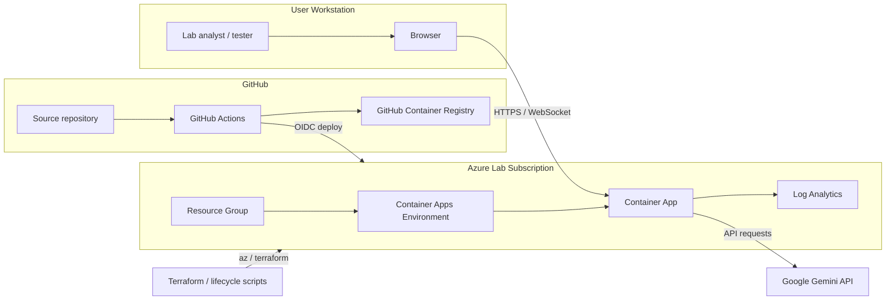

# AetosAI Lab Threat Model

## Scope

This threat model covers the non-production AetosAI lab clone that will be deployed into Azure for security testing. It does not cover the live production application or any production data, secrets, or infrastructure.

## System Summary

The lab application is a single Node.js process built from a React 19 and Vite frontend plus an Express backend. It exposes chat, scenario, health, compliance evidence, red-team audit, and WebSocket voice endpoints. The backend depends on Gemini API access and uses in-memory server evidence plus browser localStorage for some client-side records.

## Assets

- Lab application source code
- Azure Container Apps environment and container app
- Lab Gemini API key
- Synthetic test accounts and headers
- Compliance evidence generated by the lab
- Local browser audit cache and corrections cache
- Terraform state and deployment metadata
- GitHub Actions secrets and workflow configuration

## Users

- Lab analyst: reviews scenarios, evidence, and findings
- Lab tester: runs validated security tests in scope
- Lab observer: inspects state, status, and non-sensitive evidence
- Lab administrator: deploys, stops, starts, and destroys the lab

## External Services

- Google Gemini API
- Azure Container Apps
- Azure Log Analytics workspace
- GitHub Actions and GitHub Container Registry

## Authentication And Authorization Boundaries

- The app does not use a full identity provider for end users in the inspected code.
- Actor identity is passed through request headers and browser state.
- SOC 2 enforcement and shadow containment logic decide whether a request proceeds.
- The lab must never accept production credentials or production identities.
- The lab training mode remains disabled by default via `LAB_TRAINING_MODE=false`.

## Trust Boundaries

1. Browser to application server.
2. Application server to Gemini API.
3. GitHub Actions to Azure through OIDC.
4. Terraform and lifecycle scripts to Azure control plane.
5. Synthetic test data to lab-only storage and browser caches.

## Data Flow Diagram

## Data Flow Notes

- Chat and scenario traffic flows from the browser to `/api/chat` and `/api/scenarios`.
- Voice traffic flows through `/api/live` over WebSocket when enabled.
- Compliance records are generated server-side and cached locally for review.
- The application should not rely on production browser caches or production identity headers.

## STRIDE Analysis

### Spoofing

- Header-based actor identity can be spoofed if the lab is exposed without a trusted front door or proxy.
- Gemini API credentials could be impersonated if secrets are leaked.

### Tampering

- Request bodies and request headers can be tampered with before the backend evaluates them.
- Terraform state or GitHub Actions variables can be altered if access controls are weak.

### Repudiation

- Without immutable evidence, it may be difficult to prove who triggered a lab test or modified a finding.
- Client-side caches are not sufficient audit evidence.

### Information Disclosure

- Gemini prompts and responses may reveal sensitive lab context if secrets or production data are reused.
- Browser localStorage could leak cached evidence on shared machines.

### Denial Of Service

- Excessive chat or WebSocket traffic could consume Gemini quota or app compute.
- Misconfigured Azure resources could create unnecessary cost or throttle test traffic.

### Elevation Of Privilege

- A lab user could overstep intended action scope if headers or test accounts are not constrained.
- CI/CD secrets could permit unauthorized deployment if workflow permissions are too broad.

## Risk Register

| Risk | Likelihood | Impact | Notes |
| --- | --- | --- | --- |
| Header spoofing | Medium | High | Mitigate with trusted ingress and explicit scope checks. |
| Secret leakage | Medium | High | Keep Gemini keys and Azure credentials lab-only and short-lived. |
| Excessive agency in tests | Medium | High | Keep training mode disabled until intentionally enabled in a separate phase. |
| Data leakage through localStorage | Medium | Medium | Use only synthetic data and avoid production data in browser caches. |
| Cost exhaustion | Low | High | Enforce scale-to-zero and low replica limits. |

## OWASP Top 10 For LLM Applications Mapping

- LLM01 Prompt Injection: request content can try to influence the mentor or red-team flows.
- LLM02 Insecure Output Handling: generated output must not be blindly rendered or executed.
- LLM03 Training Data Poisoning: synthetic lab content should be trusted only after review.
- LLM04 Model Denial Of Service: rate limits and payload caps are necessary.
- LLM05 Supply Chain Vulnerabilities: dependency and image scanning are required.
- LLM06 Sensitive Information Disclosure: production data must not enter the lab.
- LLM07 Insecure Plugin Design: tool and route permissions must be explicit.
- LLM08 Excessive Agency: training mode must stay disabled by default.
- LLM09 Overreliance: human validation is required before treating model output as truth.
- LLM10 Model Theft: prompts and model behavior should not expose sensitive instructions.

## OWASP API Security Top 10 Mapping

- API1 Broken Object Level Authorization: validate resource access by scoped test identity.
- API2 Broken Authentication: do not trust unauthenticated or production-derived headers.
- API3 Broken Object Property Level Authorization: restrict fields and request bodies in tests.
- API4 Unrestricted Resource Consumption: enforce rate limits and payload caps.
- API5 Broken Function Level Authorization: limit access to red-team and shadow routes.
- API6 Unrestricted Access to Sensitive Business Flows: protect lab-only audit and containment flows.
- API7 Server Side Request Forgery: do not expose arbitrary outbound fetch paths.
- API8 Security Misconfiguration: ensure Azure origin and CORS settings match the lab.
- API9 Improper Inventory Management: keep routes documented and scope-labeled.
- API10 Unsafe Consumption of APIs: validate Gemini and Azure calls before execution.

## AI-Specific Risks To Evaluate Later

- Prompt injection
- Indirect prompt injection
- System-prompt disclosure
- Sensitive-information disclosure
- Insecure output handling
- Excessive agency
- Improper tool permissions
- Cross-user data exposure
- Retrieval poisoning
- Model or API cost abuse
- Inadequate rate limiting
- Unsafe handling of generated content

## Security Control Priorities

1. Keep production data out of the lab.
2. Preserve trusted boundaries for headers, secrets, and API calls.
3. Use low-cost Azure hosting with scale-to-zero or stop controls.
4. Maintain evidence for findings and test actions.
5. Add intentionally vulnerable training behavior only in a separate later phase.
